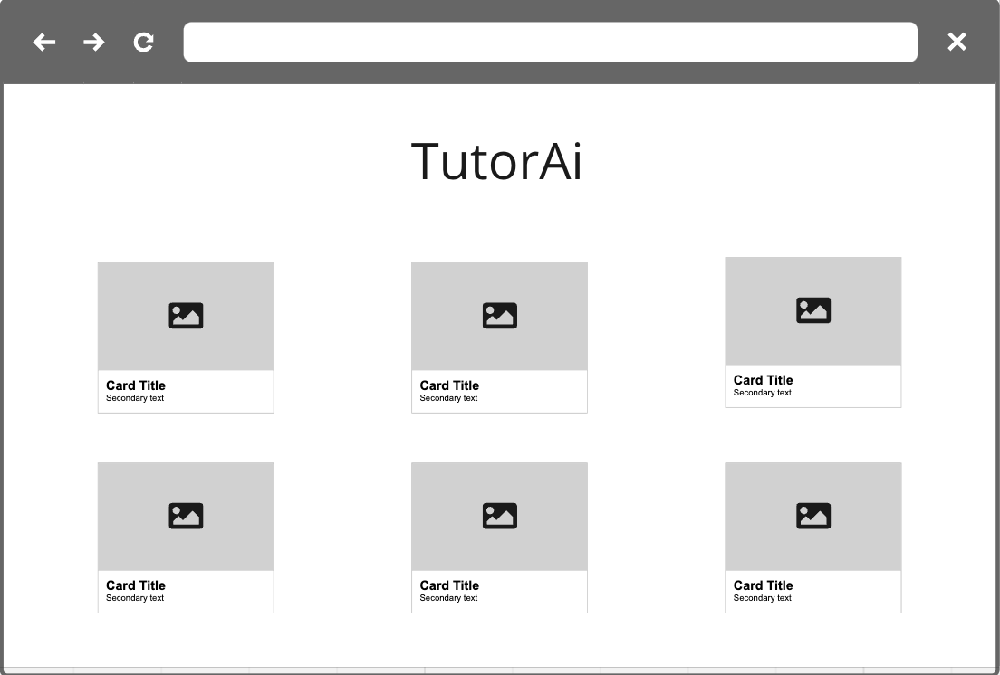
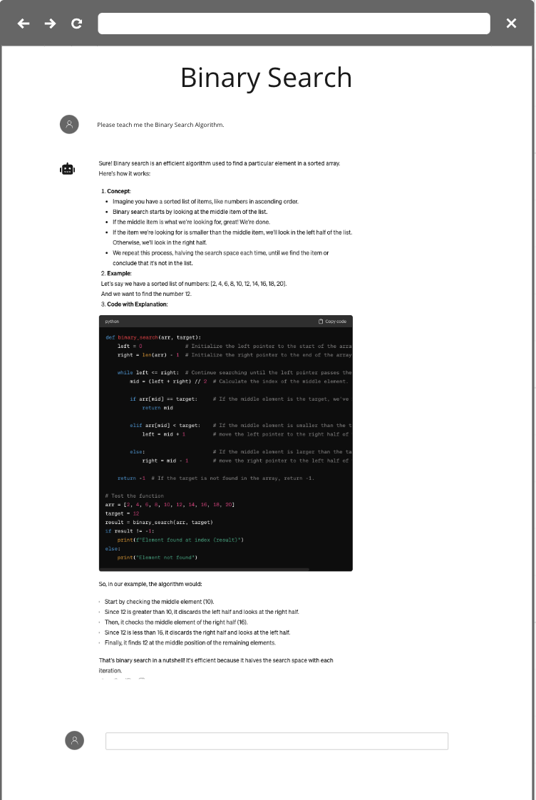

# TutorAi
TutorAi is a platform designed to empower people who are new to programming, particularly those without a conventional computer science background. Leveraging sophisticated AI models, TutorAi delivers comprehensive explanations on diverse programming topics. By harnessing the capabilities of trained AI models, the platform provides personalized guidance, making complex concepts digestible and fostering an inclusive learning environment for aspiring programmers.

## Tech Stack
React | Django | JavaScript | Python

## LoFi Wireframes

## User Stories
* AAU, I want to be able to recieve a simplified explanation of a topic
* AAU, I want to be able to ask the Ai clarifying questions
* AAU, I want to be able to easily navigate the various topics

## MVP
* User should see a list or grid of topics
* When a topic is clicked, a simple and high level explanation should be automatically provided
* User should be able to ask clarifying questions and recieve simplified answers
* The Ai model should be trained on how to provide not only accurate but simplified explanations
## Stretch Goals
* Create user profiles
* User's previous conversations can be saved
* User can take notes and reference them later